# DB-2023-RestAPI

  
  

  <h2>Короткий зміст</h2>
  <ol>
    <li><a href="#section1"> Кому буде корисним цей гайд? 🤔</a></li>
    <li><a href="#section2"> Що таке RestAPI та RestfulAPI? Різниця між ними 📲</a></li>
    <li><a href="#section3"> HTTP запити 📤</a></li>
    <li><a href="#section4"> Структура типових API та Microservice додатків 🛠</a></li>    
    <li><a href="#section5"> Приклади реалізація Restful-сервісу на мовах програмування C#, JavaScript, Python ⚙️</a></li>
	<li><a href="#section6"> Корисні посилання 🔗</a></li>
  </ol>
  

  

	<h2>Вступ</h2>
	
 Цей гайд допоможе Вам розробити найпростіший Restful-сервіс всього за 10 хвилин! Тут зібрана уся базова інформація про структуру веб сервісу, 
	та пояснено, як користувач взаємодіє з ним через HTTP запити. Для кращої візуалізації матеріалу будуть приведенті відповідні фото та діаграми. 

	
Також, для того, щоб скористатися цим гайдом вам потрібно становити відповідне IDE для кожної з мов програмування, а саме:

	<ul>
		<li>Для C# - Visual Studio(2022);</li>
		<li>Для JavaScript - Visual Studio Code;</li>
		<li>Для Python - PythPyCharm або Visual Studio(2022);</li>
	</ul>
  

<!-- Розділ 1 -->

  <h3>1. Кому буде корисним цей гайд? 🤔</h3>
  
Наш посібник буде корисним насамперед back-end розробникам та людям, які прагнуть до нових знань. Це також може бути цікаво викладачу, та 
  взагалі буть-кому, хто цікавиться методами взаємодії з Restful services та базами даних. Дізнаватись щось нове завжди приємно!😋

<!-- Розділ 2 -->

  <h3>2. Що таке RestAPI та RestfulAPI? Різниця між ними 📲</h3>

<!-- Розділ 3 -->

  <h3>3. HTTP запити 📤</h3>

<!-- Розділ 4 -->

  <h3>4. Структура типових API та Microservice додатків 🛠</h3>

<!-- Розділ 5 -->

  <h3>5. Приклади реалізація Restful-сервісу на мовах програмування C#, JavaScript, Python ⚙️</h3>
  

     
Розробка REST API на C# з Entity framework core та Pomelo 🟣

  
1. Після встановлення Visual studio(бажано версія 2022), створюємо проєкт як показано на знімку екрану

  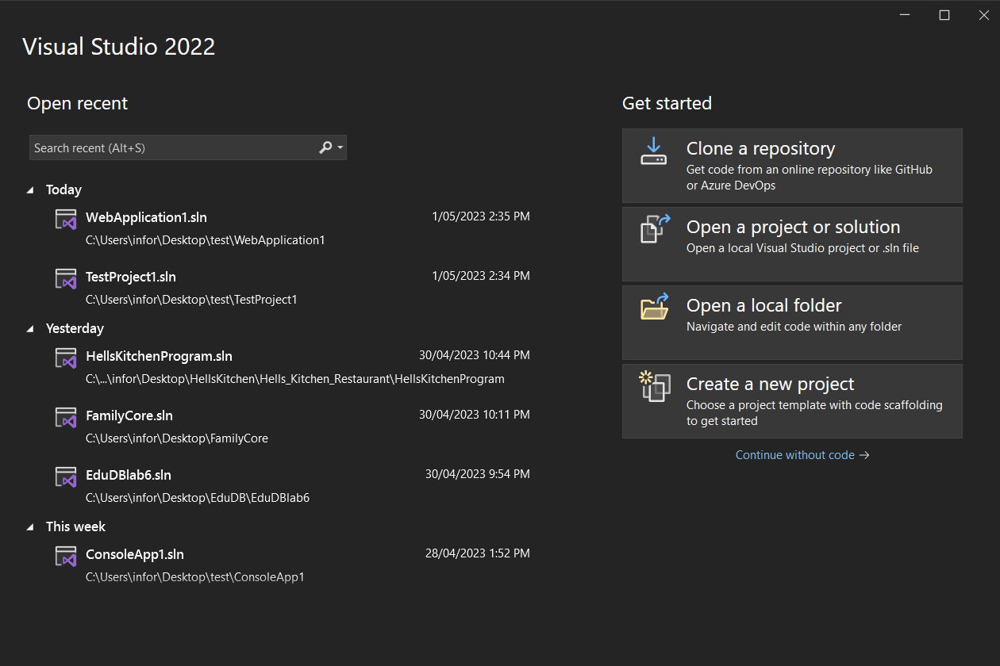
   
  
2. Обираємо саме ASP.NET Core Web API

  
   
  
3. Обираємо такі налаштування проекту

  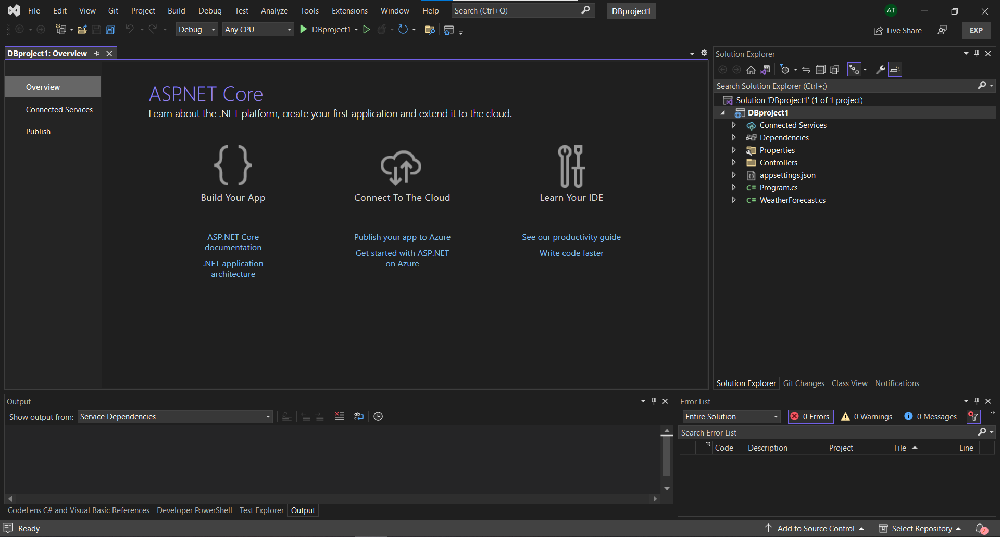 
  
4. Після створення маємо такий стартовий пакет, який включає деякий код у контролері, стартовому файлі проекту «Program.cs» та клас-приклад “WeatherForecast.cs”, який можна сміливо видаляти, він нам не знадобиться.

  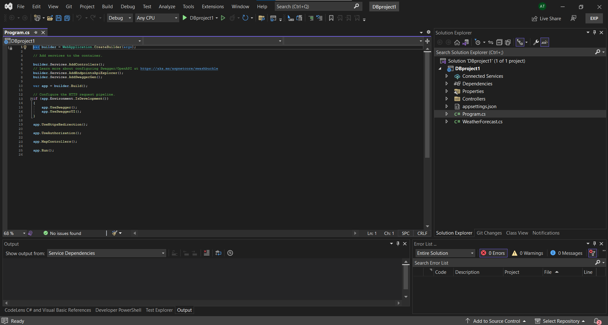
   
  
5. Ви можете порівняти початкові файли зі знімками на екрані

	<ul>
		<li>Перейменуємо контролер та видалимо зайве з нього.</li>
    
    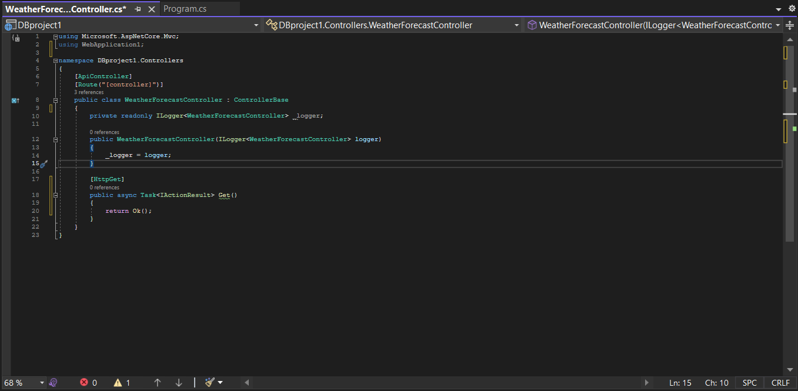
    <li>Приведіть контролер до такої початкової форми, щоб мати змогу потім будувати його без написання його з нуля.</li>
 	</ul>
  
6. Почнемо підготовлювати бібліотеки які потрібна нам для безпосередньої роботи з базою даних. Тиснемо на файл проекту, та у меню обираємо кнопку «Manage NuGetPackages»

  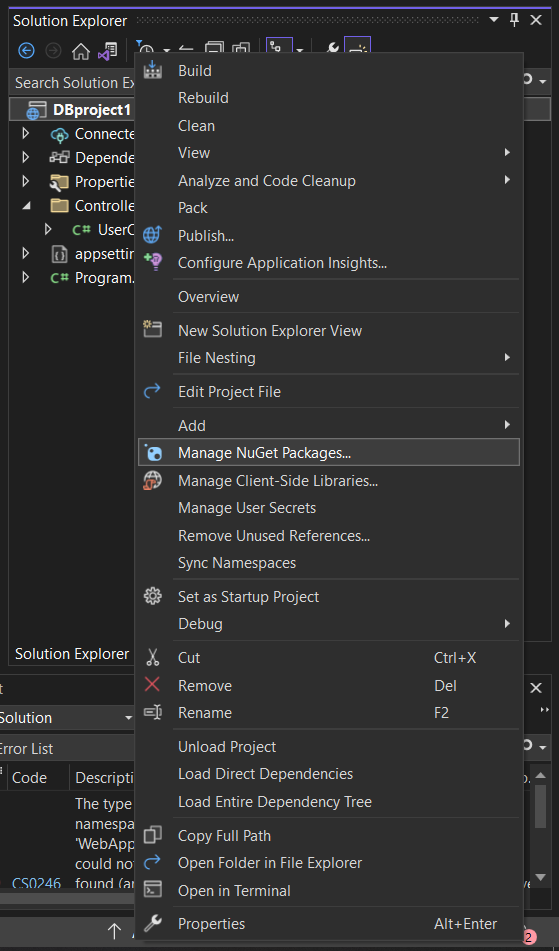
  
7. У менеджері нугет пакетів, маємо обрати зверху вкладку Browse та встановити три пакети: Pomelo, Entity framework та Swashbuckle

	
Pomelo – пакет який дозволяє працювати з базами даних створених за допомогою MySQL
Entity framework core – спеціальна бібліотека засобів для безпосереднього спілкування з базою (цей фреймворк перетворює код C# у SQL)
SwashBuckle – засіб для полегшення роботи програміста, пропонує нам простий юзер інтерфейс при роботі з API під назвою Swagger, дуже зручний при розробці інструмент(швидка альтернатива PostMan)
  

  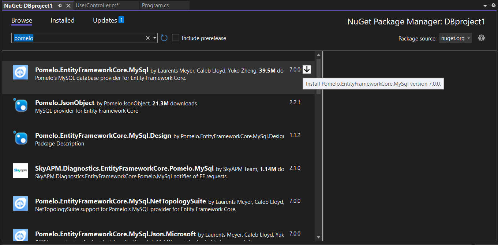
  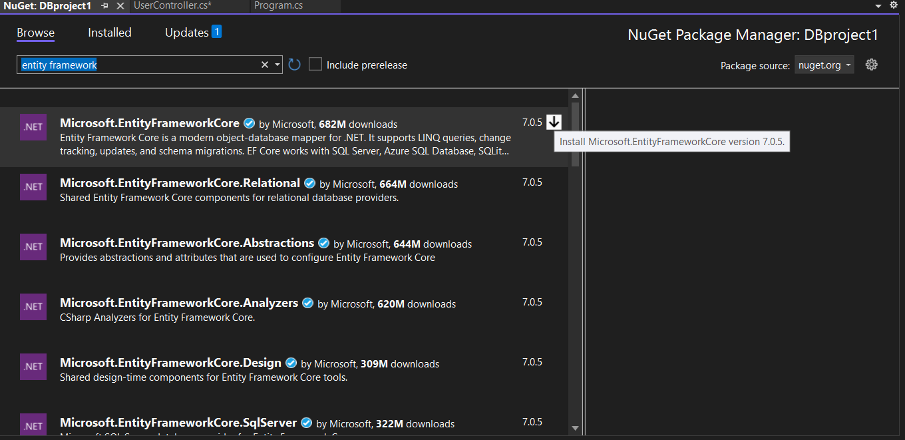
  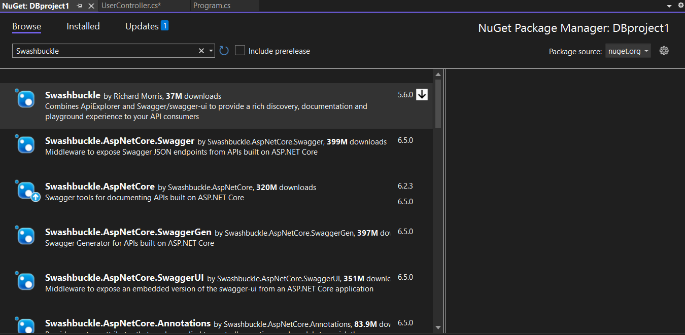
  
8.	Спочатку для використання Swagger потрібно налаштувати стартовий файл проекту, для вашої зручності ви можете взяти код з нашого стартового файлу, та змінити декілька полів, якщо хочете дізнатись більше про конфігурацію Swagger завітайте до сайту <a href="https://swagger.io/docs/open-source-tools/swagger-ui/usage/configuration/">(Посилання)</a>

  <pre><code>using Microsoft.OpenApi.Models;

  var builder = WebApplication.CreateBuilder(args);

  builder.Services.AddControllers();
  builder.Services.AddEndpointsApiExplorer();
  builder.Services.AddSwaggerGen(c =>
  {
      c.SwaggerDoc("v1", new OpenApiInfo { Title = "YourProjectName", Version = "v1" });
  });

  var app = builder.Build();

  if (app.Environment.IsDevelopment())
  {
      app.UseSwagger();
      app.UseSwaggerUI();
  }

  app.UseSwagger();
  app.UseSwaggerUI(c =>
  {
      c.SwaggerEndpoint("/swagger/v1/swagger.json", "YourProjectName V1");
  });

  app.UseHttpsRedirection();

  app.UseAuthorization();

  app.MapControllers();

  app.Run();

  </code></pre>
  
9.	У кінці матимете ось такий файл, можете запустити проект щоб подивитись як працює swagger, нижче на знімках екрану є приклад інтерфейсу, тут ви можете використати апі які ви написали у контролері, повторюючись, ви можете робите це саме у постмані, просто таким чином матимете більш зручний інтерфейс.

  
  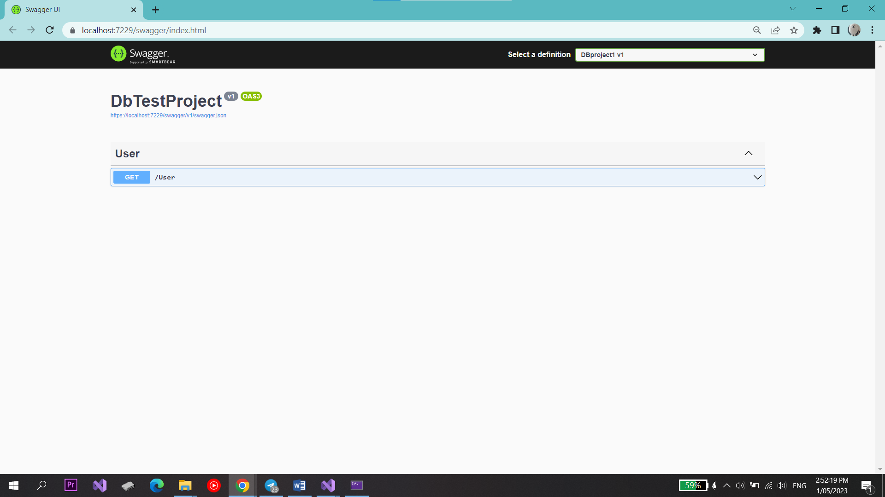
  
  
  
10. Перед початком роботи з базою, нам потрібно буде створити папку у якій будуть створені конвертовані у C# класи, об’єкти з бази даних

  
  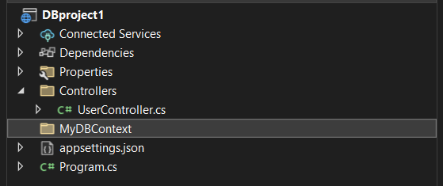
  
11. Після створення папки, знаходимо у пошуковій стрічці на панелі зверху Package Manager Console

  
  
12. Нам знадобиться деякий окремий модуль бібліотеки EF core під назвою Tools, вводимо таку команду у Package manager console, та після виконання рухаємось далі до підключення до бази даних

  
  
  
13. Після встановлення інструментів EF core, стягуємо(конвертуємо) базу даних у наш проект за допомогою такої команди:

  <ul>
		<li>Scaffold-DbContext "server=назва серверу;port=порт айді;database=назва бази даних(схеми);uid=Нікнейм, який використовується при вході у воркбенч;password=Пароль при вході" Pomelo.EntityFrameworkCore.MySql -OutputDir MyDBContext -f</li>
    
    
    <li>Після написання Scaffold-DbContext записуємо стрічку-підключення по сигнатурі, приведеній на знімку екрана, або написаній. Потім вводимо назву бібліотеки яка буде використовуватись при створенні контексту бази, та маркер OutPutDirectory після якого пишемо назву папки яку створили і ставимо прапорець –f для створення нової папки якщо ви забудете її створити.</li>
 	</ul>
  
14. Якщо ви зробили все правильно, у цій папці ви отримаєте список конвертованих об’єктів з вашої бази та контекст бази, який уособлює собою створений прототип бази, який потрібен при використанні EF для доступу до бази. Якщо ви зробили щось не так, Package Manager Console сповістить вас помилкою, яку ви можете скопіювати і знайти в інтернеті.

  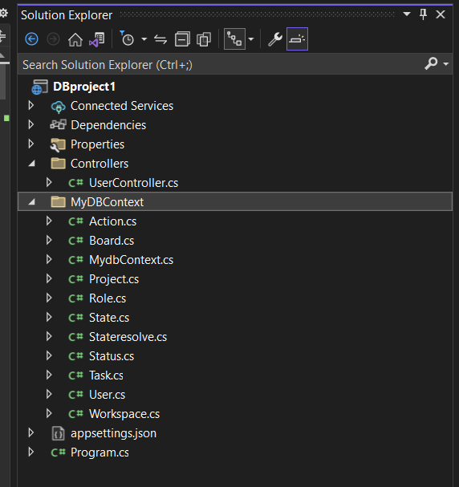
  
15. Після стягування бази, потрібно додати у Program.cs

  <pre><code>builder.Services.AddDbContext&lt;MydbContext&gt;();</pre></code>
  
Наприкінці, матимете ось такий стартовий файл: 

  
  
16. Для доступу до бази через контролер нам потрібно зробити деякі зміни у ньому. По-перше, почнемо з Dependency injection, та додамо контекст напряму у контролер, на знімку екрану ви можете бачити приклад ін’єкції з логером(необов’язково, використовується для логів у консоль), та самим контекстом

  
  
Після ін’єкції ми маємо приватне поле з контекстом, до якого можемо звернутись як на знімку екрану

  
  
Якщо у вас не працює асинхронний метод ToListAsync можете використати синхронний або просто натиснути на нього ПКМ та обрати Quick Actions and Refactorings… і натиснути на using, це додасть посилання на бібліотеку EF core яка має у собі цей метод

  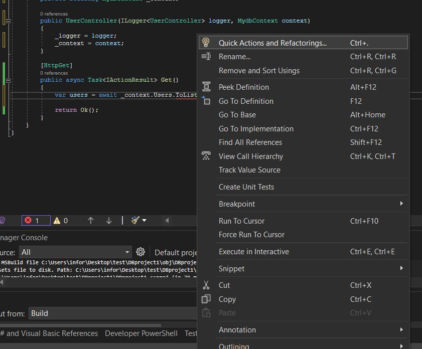
  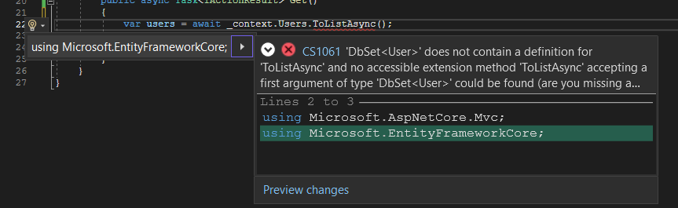
  
Також, після звертання до контексту, запишіть результат у змінну використовуючи неявне оголошення var, та виведіть її у методі Ok()

  
  
17. Після написання початкового контролеру, можемо запустити проект та спробувати використати нашу API

  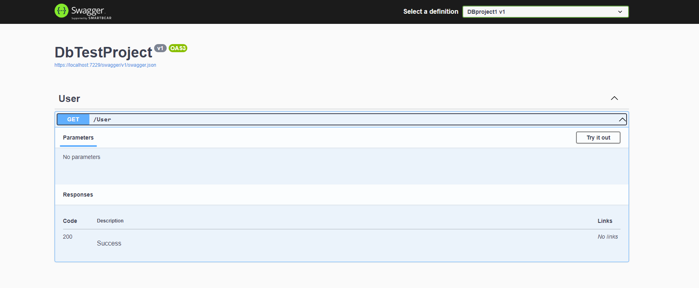
  
  
Якщо все правильно матимете, список юзерів зі своєї бази, спробуємо отримати те саме у постмані, не вимкнувши запущений проект, відкриваємо постман і можемо скопіювати регвест зі сваггеру

  
  
Та вставляємо його у постман 

  
  
Для більш дрібного розуміння у використанні EF core для отримання і зміни данних у таблиці, ми залишимо тут деякі посилання на офіційну документацію та наш контролер з лабораторної №6

  <pre><code>using EduDBlab6.Models;
  using EduDBlab6.MyDBContext;
  using Microsoft.AspNetCore.Mvc;
  using Microsoft.EntityFrameworkCore;

  namespace EduDBlab6.Controllers
  {
      [ApiController]
      [Route("[controller]")]
      public class UserController : ControllerBase
      {
          private readonly MydbContext _context;

          public UserController(MydbContext context)
          {
              _context = context;
          }

          [HttpGet()]
          public async Task<IActionResult> GetUser()
          {
              var users = await _context.Users.ToListAsync();

              return Ok(users);
          }

          [HttpGet("id")]
          public async Task<IActionResult> GetUserById(int id)
          {
              var user = await _context.Users.Where(x => x.Id == id).FirstOrDefaultAsync();

              if (user == null)
                  throw new Exception($"User with id {id} wasn't found in the database");

              return Ok(user);
          }

          [HttpPost]
          public async Task<IActionResult> AddUser(UserRequestModel user)
          {
              var existingUser = await _context.Users.Where(x => x.Id == user.Id).FirstOrDefaultAsync();

              if (existingUser != null)
                  throw new Exception("User is not found");

              var newUser = new User()
              {
                  Id = user.Id,
                  Username = user.Username,
                  Email = user.Email,
                  Password = user.Password,
                  Avatar = user.Avatar,
                  Role = user.Role
              };

              _context.Users.Add(newUser);
              await _context.SaveChangesAsync();

              return Ok(newUser);
          }

          [HttpPut("update")]
          public async Task<IActionResult> UpdateUser(UserRequestModel user)
          {
              var existingUser = await _context.Users.Where(x => x.Id == user.Id).FirstOrDefaultAsync();

              if (existingUser == null)
                  throw new Exception("The user with such id doesn't exist");

              existingUser.Username = user.Username;
              existingUser.Email = user.Email;
              existingUser.Password = user.Password;
              existingUser.Avatar = user.Avatar;
              existingUser.Role = user.Role;

              _context.Users.Update(existingUser);
              await _context.SaveChangesAsync();

              return Ok(existingUser);
          }

          [HttpDelete("id")]
          public async Task<IActionResult> DeleteUser(int id)
          {
              var deletingUser = await _context.Users.Where(x => x.Id == id).FirstOrDefaultAsync();

              if (deletingUser == null)
                  throw new Exception("The user with such id doesn't exist");

              _context.Users.Remove(deletingUser);
              await _context.SaveChangesAsync();

              return Ok();
          }
      }
  }
  </pre></code>

  

  

     
Розробка REST API на JavaScript з Node.js, MySQL та Express 🟡

  <h4>I. Створення програми Node.js</h4>
  
 Тепер, коли ми вивчили, що таке REST, і мали швидкий огляд баз даних MySQL, давайте поринемо у створення нашого додатку RESTFul.

  
1. По-перше, нам потрібно створити папку для нашого проекту з командою нижче:

  <pre><code> mkdir your-direcoty-name && cd your-direcoty-name</code></pre>
  <pre><i>	Створення нової папки для проекту</i></pre>
  
 Наведена вище команда створить папку your-direcoty-name і змінить каталог на цю папку.

  
2. Далі ми ініціалізуємо новий проект node.js командою нижче: 

  <pre><code> npm init -y</code></pre>
  <pre><i>	Ініціалізація нового проекту Node.js </i></pre>
  
 Наведена вище команда ініціалізує новий проект Node.js, пропускаючи всі підказки для деталей проекту. Команда також створить файл package.json в кореневому каталозі нашого 
  проекту, який буде записувати всі необхідні метадані про наш проект. Ви можете вирішити пройти через підказки, щоб ввести деталі проекту, видаливши прапор '-y' з команди.

  
4. Далі ми встановимо залежності, які нам потрібні для нашого проекту.

  <pre><code> npm install express MySQL cors</code></pre>
  <pre><i>	Установка Cors</i></pre>
  
 Наведена вище команда займе трохи часу, щоб завершитись, але в результаті будуть встановлені Express, MySQL і Cors.

  
5. Нарешті, давайте подивимося на нашу структуру проекту. В кінці цього підручника, наша структура проекту буде виглядати так:

  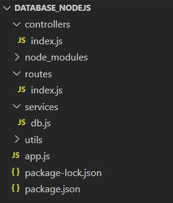
  <pre>
<i>	Структура проекту </i>
</pre>
  <h4>II. Налаштування Express сервера</h4>
  
1. 

  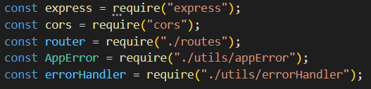
  
3. 

  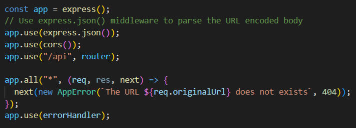
  
4. 

  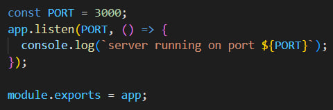
  

  

     
Розробка REST API на Python 🟢

  
1.1 

  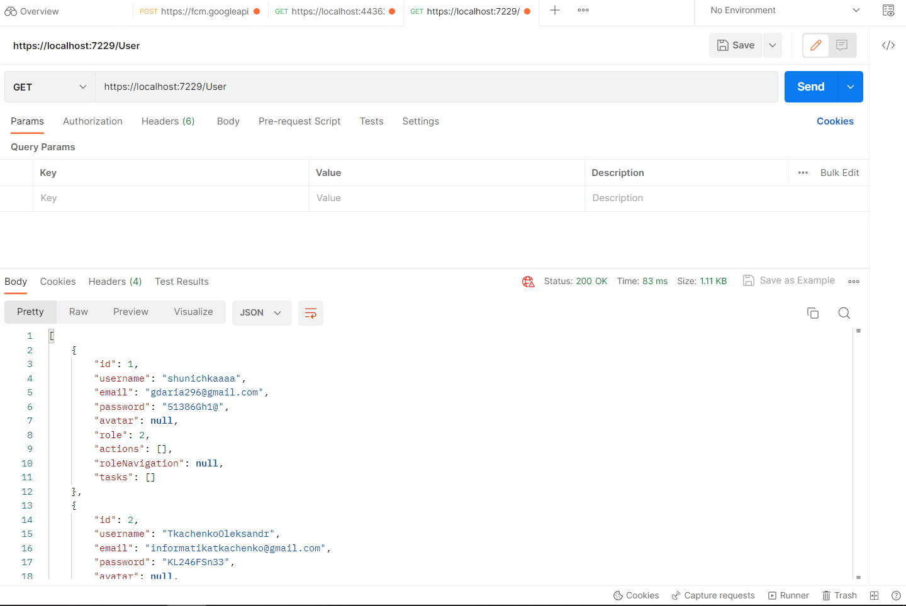
  
1.2 

  
  
1.3 

  
  
1.4 

  
  
1.5 

  
  

  <h3>6. Корисні посилання 🔗</h3>
  <ol>
	<li><a href="https://dev.mysql.com/downloads/mysql/">Завантаження MySQL Universal Installer</a></li>
	<li><a href="https://www.youtube.com/playlist?list=PLXr7EDDqEOkYiUDqyM3yMg4K2abjEyagl">Плейліст лекцій БД 2023</a></li>
	<li><a href="https://github.com/YehorSeniuk/IOO">Репозиторій проекту IOO</a></li>
	<li><a href="https://yehorseniuk.github.io/IOO/">Gh-pages проекту IOO</a></li>
  </ol>

